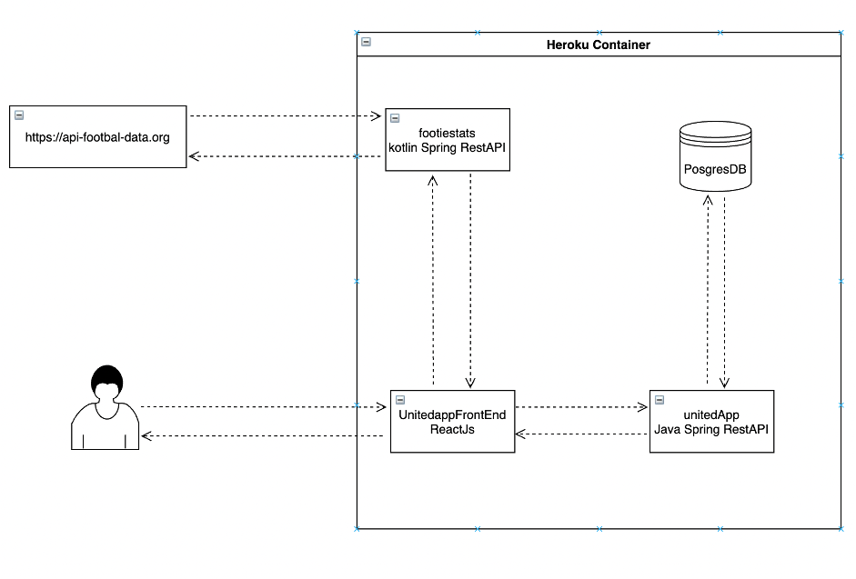

# unitedapp
The unitedapp started as a Basic Spring Boot Rest Application as a means for me to learn and practice. Over time I have added various additional microservices and components so that the unitedapp is no longer an app but a collection of apps and ideas. This repo is merely the intitial Java Spring Boot app, the others are listed below.

## -----------------------------------------------------------------------

## footiestats - https://github.com/agdevtools/footiestats
Footiestats is a Basic Spring Boot Rest Application, written in kotlin. It's main purpose, aside from teaching me kotlin, was to act as a wrapper-api for an external 3rd part api product - https://api.football-data.org - footiestats provides up-to-date league tables and fixtures form the premiere league for use in the react front end - UnitedAppReact.

## -----------------------------------------------------------------------

## unitedappfrontend - https://github.com/agdevtools/UnitedAppReact

## Architecture

to run locally in docker download latest potgres image and run :
docker run --name postgres -e POSTGRES_HOST_AUTH_METHOD=trust  -d postgres
